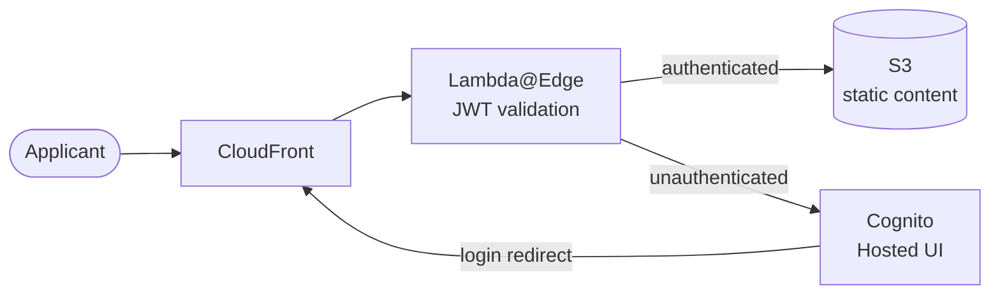

# CDK Team Applicant Portal

A CDK project that deploys a Cognito-authenticated, CloudFront-served portal for engineering team applicants. Applicants log in to access interview exercise assignments served as static HTML documents from S3.

## Architecture



## Prerequisites

- Node.js 22+
- Yarn 4 (`corepack enable && corepack prepare yarn@4.7.0 --activate`)
- AWS CLI configured with appropriate credentials
- AWS CDK CLI (`yarn cdk`)

> **Region constraint**: This stack MUST be deployed to `us-east-1`. Lambda@Edge functions and CloudFront ACM certificates require us-east-1.

## Configuration

All deployment parameters are set via CDK context. Edit `cdk.json` or pass via `--context` flag:

| Parameter | Description | Default |
|-----------|-------------|---------|
| `dnsName` | Fully qualified domain name for the portal (e.g. `apply.acme.com`) | `apply.example.com` |
| `companyName` | Short name used for resource prefixes (e.g. `acme`) | `example` |
| `certificateArn` | ARN of an existing ACM certificate in us-east-1. If empty, a new cert is created. | `""` |

### Example deployment

```bash
yarn cdk deploy \
  --context dnsName=apply.acme.com \
  --context companyName=acme \
  --context certificateArn=arn:aws:acm:us-east-1:123456789012:certificate/abc-123
```

## Setup

```bash
# Install dependencies
yarn install

# Build
yarn build

# Deploy
yarn cdk deploy --context dnsName=apply.acme.com --context companyName=acme
```

## Managing Applicants (Invite Flow)

Applicants cannot self-register. An admin must invite them:

```bash
# Invite an applicant (sends a temporary password via email)
COMPANY_NAME=acme ./scripts/invite-user.sh applicant@example.com "First" "Last"
```

On first login, the applicant will be prompted to set a permanent password via the Cognito hosted UI.

## Uploading Content

Place your HTML content in a folder and sync it to the S3 bucket:

```bash
# Sync content folder to S3 and invalidate CloudFront cache
COMPANY_NAME=acme CONTENT_DIR=./content ./scripts/upload-content.sh
```

The content folder should contain at minimum `index.html` and `error.html`.

## DNS Configuration

After deployment, the stack outputs the CloudFront distribution domain name. Create a CNAME record in your DNS provider:

```
apply.acme.com  CNAME  d1234abcd.cloudfront.net
```

If you let CDK create the ACM certificate (no `certificateArn` provided), check the ACM console for the DNS validation record to add before the certificate will validate.

## Useful Commands

```bash
yarn build          # Compile TypeScript
yarn test           # Run Jest tests
yarn cdk synth      # Synthesize CloudFormation template
yarn cdk diff       # Show pending infrastructure changes
yarn cdk deploy     # Deploy to AWS
yarn cdk destroy    # Tear down all resources
```
