# Architecture Overview

This document describes the architecture of the CDK Team Applicant Portal — a fully serverless, invite-only portal for engineering applicants, deployed on AWS using CDK (TypeScript).

---

## Table of Contents

- [System Overview](#system-overview)
- [Infrastructure Diagram](#infrastructure-diagram)
- [AWS Resources](#aws-resources)
  - [S3 — Content Bucket](#s3--content-bucket)
  - [S3 — CloudFront Access Logs Bucket](#s3--cloudfront-access-logs-bucket)
  - [CloudFront Distribution](#cloudfront-distribution)
  - [Lambda@Edge — Viewer Request](#lambdaedge--viewer-request)
  - [Amazon Cognito](#amazon-cognito)
  - [ACM Certificate](#acm-certificate)
  - [SSM Parameter Store](#ssm-parameter-store)
  - [CloudWatch Log Groups](#cloudwatch-log-groups)
- [Authentication Flow](#authentication-flow)
- [Request Flow](#request-flow)
- [CDK Project Structure](#cdk-project-structure)
- [Security Design](#security-design)
- [Configuration & Deployment](#configuration--deployment)

---

## System Overview

The applicant portal serves static HTML content to authenticated applicants only. Authentication is handled entirely at the edge using Lambda@Edge before any content is fetched from S3. Applicants cannot self-register — an admin must invite them via Cognito.

Key characteristics:

- **Fully serverless** — no EC2, no containers, no persistent compute
- **Edge authentication** — JWT validation occurs at CloudFront edge locations globally before origin is ever contacted
- **Invite-only access** — Cognito is configured with self-signup disabled; users are added by administrators
- **Region constraint** — must deploy to `us-east-1` due to Lambda@Edge and ACM requirements for CloudFront

---

## Infrastructure Diagram


---

## AWS Resources

### S3 — Content Bucket

Stores all static content (HTML, CSS, JS, assets) served to authenticated applicants.

| Property | Value |
|---|---|
| Name | `{companyName}-applicant-portal-{account}-{region}` |
| Access | Private — no public access |
| Encryption | S3-managed (SSE-S3) |
| Transport | SSL-only (bucket policy denies HTTP) |
| Access method | CloudFront Origin Access Control (OAC) |
| Lifecycle | Delete incomplete multipart uploads after 7 days |
| Removal policy | `RETAIN` — survives stack deletion |

CloudFront is the **only** entity that can read from this bucket, enforced via an OAC resource policy.

---

### S3 — CloudFront Access Logs Bucket

Receives CloudFront access logs for auditing and debugging.

| Property | Value |
|---|---|
| Log prefix | `cloudfront-access-logs/` |
| Retention | Logs expire after 90 days |
| Removal policy | `DESTROY` |

---

### CloudFront Distribution

The global entry point for all requests. Handles TLS termination, caching configuration, and routes every request through Lambda@Edge before touching the origin.

| Property | Value |
|---|---|
| Custom domain | `{dnsName}` (e.g., `apply.acme.com`) |
| TLS certificate | ACM (us-east-1) |
| Min TLS version | TLS 1.2 (2021) |
| HTTP versions | HTTP/2 and HTTP/3 |
| IPv6 | Enabled |
| Price class | `PRICE_CLASS_100` (US, Canada, Europe) |
| Default root | `index.html` |
| Viewer protocol | Redirect HTTP → HTTPS |
| Cache policy | `CACHING_DISABLED` (always fresh) |
| Origin request policy | `CORS_S3_ORIGIN` |

**Error responses:**

| HTTP Code | Response | TTL |
|---|---|---|
| 403 | `/error.html` | 5 minutes |
| 404 | `/error.html` | 5 minutes |

---

### Lambda@Edge — Viewer Request

Runs on every incoming request at the CloudFront edge location closest to the user. This is the authentication gateway — no request reaches S3 without passing through this function.

| Property | Value |
|---|---|
| Event type | `VIEWER_REQUEST` |
| Runtime | Node.js 22.x |
| Timeout | 5 seconds |
| Memory | 128 MB |
| Bundler | esbuild (minified, CJS) |
| SSM path | Inlined at bundle time via esbuild `define` |

**Function responsibilities:**

1. **Load Cognito config** — reads from SSM Parameter Store on first invocation; cached in-memory thereafter
2. **Handle `/oauth2/callback`** — serves an HTML page with inline JavaScript that extracts tokens from the URL fragment and sets secure cookies, then redirects to the original destination
3. **Pass through `/error.html`** — error page is accessible without authentication
4. **Validate JWT** — checks the `CognitoIdentityServiceProvider.{clientId}.idToken` cookie using JWKS (public keys fetched from Cognito)
5. **Redirect unauthenticated users** — sends a `302` to the Cognito Hosted UI with the original URL preserved in OAuth `state`
6. **Forward authenticated requests** — adds an `X-Auth-Email` header and allows the request to proceed to S3

---

### Amazon Cognito

Manages user identities, authentication, and the hosted login UI.

**User Pool:**

| Property | Value |
|---|---|
| Name | `{companyName}-applicant-portal` |
| Self-signup | Disabled (invite-only) |
| Sign-in alias | Email only |
| Email auto-verify | Enabled |
| MFA | Optional (TOTP only; SMS disabled) |
| Account recovery | Email only |
| Feature plan | Essentials |

**Required user attributes:** `email` (immutable), `given_name`, `family_name`

**Password policy:** Minimum 10 characters; requires lowercase, uppercase, digits, and symbols. Temporary password valid for 7 days.

**App Client:**

| Property | Value |
|---|---|
| OAuth flows | Implicit (tokens returned in URL fragment) |
| Scopes | `openid`, `email`, `profile` |
| Callback URL | `https://{dnsName}/oauth2/callback` |
| Logout URL | `https://{dnsName}/` |
| ID token validity | 12 hours |
| Access token validity | 12 hours |
| Refresh token validity | 30 days |

**Hosted UI Domain:** `https://{companyName}-applicant-portal.auth.{region}.amazoncognito.com`

---

### ACM Certificate

TLS certificate for the custom domain attached to CloudFront.

| Scenario | Behavior |
|---|---|
| `certificateArn` context provided | Imports the existing certificate |
| `certificateArn` not provided | Creates a new certificate with DNS validation |

> **Note:** The certificate must be in `us-east-1` regardless of where other resources are deployed — this is an AWS requirement for CloudFront.

---

### SSM Parameter Store

Stores Cognito configuration that Lambda@Edge reads at runtime.

| Property | Value |
|---|---|
| Parameter name | `/{companyName}/applicant-portal/cognito-config` |
| Type | `String` |
| Value (JSON) | `userPoolId`, `clientId`, `region`, `cognitoDomainPrefix`, `appDomain` |

The Lambda@Edge function has an IAM policy granting `ssm:GetParameter` for this specific parameter. The SSM path is inlined into the Lambda bundle at CDK synthesis time via esbuild `define`, so there are no hardcoded strings in source code.

---

### CloudWatch Log Groups

| Group | Retention | Removal |
|---|---|---|
| `/aws/cognito/userpool/{companyName}-applicant-portal` | 1 month | DESTROY |
| `/aws/lambda/us-east-1.{stackName}-ViewerRequest` | 1 month | DESTROY |

---

## Authentication Flow

The portal uses OAuth 2.0 implicit flow. Tokens are delivered via URL fragment (client-side extraction) to avoid tokens appearing in server-side logs.

```mermaid
sequenceDiagram
    actor User as 👤 Applicant
    participant CF as CloudFront
    participant LE as Lambda@Edge
    participant SSM as SSM Parameter Store
    participant Cognito as Cognito Hosted UI
    participant S3 as S3 Bucket

    User->>CF: GET https://apply.acme.com/
    CF->>LE: Invoke (viewer-request)

    alt First invocation (cold start)
        LE->>SSM: GetParameter (cognito-config)
        SSM-->>LE: { userPoolId, clientId, ... }
    end

    LE->>LE: Check for idToken cookie

    alt No cookie / invalid / expired token
        LE-->>CF: 302 Redirect
        CF-->>User: 302 → Cognito Hosted UI\n?client_id=...&state=/original-path
        User->>Cognito: Login (email + password)
        Cognito-->>User: 302 → https://apply.acme.com/oauth2/callback\n#id_token=...&state=/original-path
        User->>CF: GET /oauth2/callback#id_token=...
        CF->>LE: Invoke (viewer-request)
        LE-->>CF: 200 HTML (callback page)
        CF-->>User: Callback HTML + JS
        Note over User: JS sets cookies,\nredirects to /original-path
        User->>CF: GET /original-path (with cookie)
        CF->>LE: Invoke (viewer-request)
    end

    LE->>LE: Validate JWT (JWKS signature,\nissuer, audience, expiry)
    LE-->>CF: Allow request + X-Auth-Email header
    CF->>S3: Fetch /original-path (via OAC)
    S3-->>CF: Static content
    CF-->>User: 200 Content
```



---

## Request Flow

Every request — authenticated or not — passes through the same pipeline. The only branching point is inside Lambda@Edge.


---

## CDK Project Structure

The stack uses a **builder pattern** — each major infrastructure component is encapsulated in its own builder class. The main stack composes them together.


**Build-time data flow:**

```
cdk.context.json
    └── PortalConfig (validates + normalizes)
            ├── companyName slug → resource naming
            ├── dnsName → certificate domain + Cognito callback URL
            └── certificateArn → create or import ACM cert

SSM parameter path
    └── Inlined into Lambda bundle via esbuild define
            └── Lambda reads SSM at runtime (first request only)
```

---

## Security Design

| Control | Implementation |
|---|---|
| No public S3 access | `BlockPublicAccess.BLOCK_ALL` + OAC-only bucket policy |
| TLS enforcement | Bucket policy denies non-HTTPS; CloudFront min TLS 1.2 |
| Edge authentication | Lambda@Edge runs before any origin fetch |
| JWT validation | JWKS signature verification; issuer, audience, expiry checked |
| Invite-only access | Cognito self-signup disabled; admin creates users |
| Secure cookies | `HttpOnly`, `Secure`, `SameSite=Lax`; 12-hour expiry |
| XSS protection | HTML-escaped outputs in Lambda@Edge response |
| MFA support | Optional TOTP available to all users |
| Principle of least privilege | Lambda@Edge IAM allows only `ssm:GetParameter` on the specific config parameter |
| CDK Nag | Security rules enforced at synthesis time |

**Why implicit flow instead of authorization code flow?**

Lambda@Edge functions cannot maintain server-side session state across edge nodes, and they have a 5-second timeout. The implicit flow delivers tokens in the URL fragment (handled entirely in the browser), avoiding the need for a token exchange server endpoint.

---

## Configuration & Deployment

### CDK Context Parameters

| Parameter | Required | Description |
|---|---|---|
| `dnsName` | Yes | Fully qualified domain name (e.g., `apply.acme.com`) |
| `companyName` | Yes | Used to name resources and Cognito domain prefix |
| `certificateArn` | No | Existing ACM cert ARN; if omitted a new cert is created |

### Deployment

```bash
yarn install
yarn build

# Deploy (new certificate)
yarn cdk deploy \
  --context dnsName=apply.acme.com \
  --context companyName=acme

# Deploy (existing certificate)
yarn cdk deploy \
  --context dnsName=apply.acme.com \
  --context companyName=acme \
  --context certificateArn=arn:aws:acm:us-east-1:123456789012:certificate/...
```

> **Note:** Must deploy to `us-east-1`. Lambda@Edge functions and ACM certificates for CloudFront must be in the US East (N. Virginia) region.

### Post-Deployment Steps

1. **DNS validation** — if a new ACM certificate was created, add the CNAME validation records output by CDK
2. **DNS record** — create a CNAME pointing `{dnsName}` → CloudFront distribution domain
3. **Invite applicants** — `COMPANY_NAME=acme ./scripts/invite-user.sh email@example.com "First" "Last"`
4. **Upload content** — `COMPANY_NAME=acme CONTENT_DIR=./content ./scripts/upload-content.sh`
