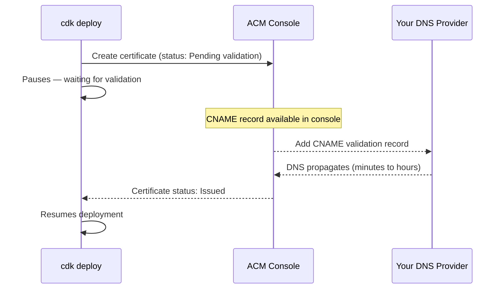
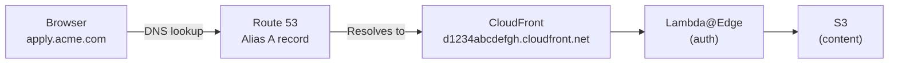

# Deployment Guide

This guide walks through deploying the CDK Team Applicant Portal end to end — from prerequisites through DNS setup and first login.

---

## Table of Contents

- [Prerequisites](#prerequisites)
- [Bootstrap the AWS Account](#bootstrap-the-aws-account)
- [Configuration](#configuration)
- [Review Changes Before Deploying](#review-changes-before-deploying)
- [Deploy](#deploy)
  - [Using an AWS Profile](#using-an-aws-profile)
  - [Certificate Options](#certificate-options)
- [DNS Steps](#dns-steps)
  - [Step 1 — ACM Certificate Validation (if creating a new certificate)](#step-1--acm-certificate-validation-if-creating-a-new-certificate)
  - [Step 2 — Point Your Domain at CloudFront](#step-2--point-your-domain-at-cloudfront)
- [Post-Deployment](#post-deployment)
- [Subsequent Deployments](#subsequent-deployments)
- [Destroying the Stack](#destroying-the-stack)

---

## Prerequisites

| Requirement                             | Notes                                                           |
| --------------------------------------- | --------------------------------------------------------------- |
| Node.js 22+                             | Check with `node --version`                                     |
| Yarn 4                                  | `corepack enable && corepack prepare yarn@4.7.0 --activate`     |
| AWS CLI                                 | Configured with credentials for the target account              |
| AWS CDK CLI                             | Installed globally (`npm install -g aws-cdk`) or via `yarn cdk` |
| AWS account bootstrapped in `us-east-1` | See [Bootstrap the AWS Account](#bootstrap-the-aws-account)     |

> **Region constraint:** This stack **must** be deployed to `us-east-1`. Lambda@Edge functions and ACM certificates used with CloudFront are required to exist in US East (N. Virginia).

Install project dependencies before doing anything else:

```bash
yarn install
yarn build
```

---

## Bootstrap the AWS Account

CDK bootstrapping provisions the S3 bucket and IAM roles that CDK needs to stage assets (including the Lambda@Edge function bundle) before deployment. This is a one-time step per account/region combination.

```bash
# Bootstrap us-east-1 (required)
cdk bootstrap aws://{ACCOUNT_ID}/us-east-1

# With a named profile
cdk bootstrap aws://{ACCOUNT_ID}/us-east-1 --profile your-profile-name
```

> If the account has already been bootstrapped in `us-east-1` you can skip this step. You can verify by checking for a stack named `CDKToolkit` in CloudFormation in `us-east-1`.

---

## Configuration

All deployment parameters are passed as CDK context. You can set them in `cdk.json` for convenience or pass them directly via `--context` flags on each command.

| Parameter        | Required | Description                                                                 | Example                     |
| ---------------- | -------- | --------------------------------------------------------------------------- | --------------------------- |
| `dnsName`        | Yes      | Fully qualified domain name for the portal                                  | `apply.acme.com`            |
| `companyName`    | Yes      | Short name used for resource prefixes and Cognito domain                    | `acme`                      |
| `certificateArn` | No       | ARN of an existing ACM certificate in `us-east-1`; omit to create a new one | `arn:aws:acm:us-east-1:...` |

**`companyName` is normalized** to a lowercase, hyphen-separated slug (e.g. `Acme Corp` → `acme-corp`) and used in S3 bucket names, the Cognito User Pool name, and the Cognito Hosted UI domain prefix.

---

## Review Changes Before Deploying

Always run a `diff` first — especially on an existing deployment — to understand exactly what CloudFormation will create, modify, or replace before you commit to it.

```bash
# Review changes with default context
yarn cdk diff \
  --context dnsName=apply.acme.com \
  --context companyName=acme

# With a named AWS profile
yarn cdk diff \
  --context dnsName=apply.acme.com \
  --context companyName=acme \
  --profile your-profile-name
```

Pay close attention to:

- Any resource marked **Replace** (`[~]` with a replacement indicator) — these will be destroyed and recreated, which can cause downtime
- Changes to the Lambda@Edge function — CloudFront associations take several minutes to propagate
- Changes to the Cognito User Pool — some attribute changes require replacement and will delete existing users

---

## Deploy

### Using an AWS Profile

If you manage multiple AWS accounts or roles, use the `--profile` flag to specify which credentials to use. The profile must be configured in `~/.aws/config` or `~/.aws/credentials`.

```bash
# New certificate (CDK creates and validates it)
yarn cdk deploy \
  --context dnsName=apply.acme.com \
  --context companyName=acme \
  --profile your-profile-name

# Existing certificate
yarn cdk deploy \
  --context dnsName=apply.acme.com \
  --context companyName=acme \
  --context certificateArn=arn:aws:acm:us-east-1:123456789012:certificate/abc-123 \
  --profile your-profile-name
```

If you have a default profile configured you can omit `--profile`.

### Certificate Options

**Option A — Let CDK create the certificate (no `certificateArn`)**

CDK will create an ACM certificate and then **pause the deployment** waiting for DNS validation. You must manually add the DNS validation record before the deployment can continue. See [Step 1 — ACM Certificate Validation](#step-1--acm-certificate-validation-if-creating-a-new-certificate) below.

**Option B — Bring an existing certificate**

Pass `--context certificateArn=arn:aws:acm:us-east-1:...` with the ARN of an already-validated certificate in `us-east-1`. The deployment will not pause for certificate validation.

---

## DNS Steps

### Step 1 — ACM Certificate Validation (if creating a new certificate)

When CDK creates a new ACM certificate, the `cdk deploy` process will **pause at this step** and print something like:

```
ApplicantPortalStack: creating CloudFormation changeset...
[███████░░░░░░░░░░░░░░░░░░░░░░░░░░░░] (4/14)

 ✅  ApplicantPortalStack

 ⏳  ApplicantPortalStack: waiting for certificate validation...
```

While it is waiting, open the **AWS Certificate Manager console** (`us-east-1`) and locate the pending certificate. ACM will show a CNAME record that must be added to your DNS zone to prove domain ownership.



**Where to add the record** depends on where your DNS is hosted:

- **Route 53** — ACM can add the record automatically if you click "Create record in Route 53" in the ACM console
- **Other providers** — copy the CNAME name and value from the ACM console and add it manually in your DNS provider's control panel

DNS propagation can take anywhere from a few minutes to several hours. The `cdk deploy` terminal will continue waiting until the certificate is issued. Do not interrupt the process.

---

### Step 2 — Point Your Domain at CloudFront

Once the deployment completes, CDK outputs the CloudFront distribution domain name:

```
Outputs:
ApplicantPortalStack.DistributionDomainName = d1234abcdefgh.cloudfront.net
```

You now need to create a DNS record that points your custom domain (`apply.acme.com`) to this CloudFront distribution.

#### Recommended — Route 53 Alias A record

If your domain is hosted in **Route 53**, use an **Alias A record** instead of a CNAME. Alias records are free (no per-query charge), support the zone apex (e.g. `acme.com` directly), and resolve faster.

```
Type:  A (Alias)
Name:  apply.acme.com
Alias: d1234abcdefgh.cloudfront.net  (CloudFront distribution domain)
```

In the Route 53 console: select your hosted zone → **Create record** → toggle **Alias** → set target to **Alias to CloudFront distribution** → select the distribution from the dropdown.



#### Alternative — CNAME record (non-Route 53 providers)

If your DNS is hosted elsewhere, add a CNAME:

```
Type:  CNAME
Name:  apply            (or apply.acme.com depending on your provider)
Value: d1234abcdefgh.cloudfront.net
TTL:   300
```

> **Note:** CNAMEs cannot be used at the zone apex (e.g. you cannot CNAME `acme.com` directly). If the portal must live at the root domain, use Route 53 Alias records or a DNS provider that supports ALIAS/ANAME flattening.

---

## Post-Deployment

Once DNS is resolving correctly:

**1. Invite applicants**

Applicants cannot self-register. An admin creates each user:

```bash
# Company name is auto-detected from cdk.json when run from the project root
./scripts/invite-user.sh --email applicant@example.com --first Jane --last Smith

# Or pass it explicitly alongside an AWS profile
./scripts/invite-user.sh --email applicant@example.com --first Jane --last Smith \
  --company acme --profile your-profile-name
```

The applicant receives an email with a temporary password valid for 7 days. On first login they will be prompted to set a permanent password via the Cognito Hosted UI.

If an invitation expires before the applicant uses it, resend it:

```bash
./scripts/invite-user.sh --resend --email applicant@example.com --company acme
```

Run with `--help` to see all options, or `--dry-run` to verify credentials and stack lookup without creating a user.

**2. Upload content**

Sync your HTML content to S3 and invalidate the CloudFront cache:

```bash
# ./content is used by default; company auto-detected from cdk.json
./scripts/upload-content.sh

# Explicit options
./scripts/upload-content.sh --content ./my-content --company acme --profile your-profile-name

# Upload and wait until the invalidation has fully propagated before returning
./scripts/upload-content.sh --wait
```

The content directory must contain at minimum `index.html` and `error.html`. By default, files present in S3 but absent from the local directory are removed — pass `--no-delete` to preserve them. Run with `--dry-run` to preview what would change without uploading anything.

**3. List users**

View all applicant accounts in the User Pool:

```bash
# Table view — company auto-detected from cdk.json
./scripts/list-users.sh

# Filter by status
./scripts/list-users.sh --status FORCE_CHANGE_PASSWORD

# Filter by email prefix
./scripts/list-users.sh --email jane@

# Count confirmed users only
./scripts/list-users.sh --status CONFIRMED --count

# Export as CSV
./scripts/list-users.sh --format csv > users.csv

# One email per line (for piping to other scripts)
./scripts/list-users.sh --format quiet
```

Output formats: `table` (default, aligned columns), `csv`, `json` (raw AWS response), `quiet` (one email per line). Run with `--help` to see all options.

**4. Remove users**

Delete or disable an applicant account:

```bash
# Remove a user (prompts for confirmation)
./scripts/remove-user.sh --email applicant@example.com

# Disable instead of delete — blocks login but preserves the account (reversible)
./scripts/remove-user.sh --email applicant@example.com --disable

# Skip confirmation prompt
./scripts/remove-user.sh --email applicant@example.com --yes

# Preview what would happen without making any changes
./scripts/remove-user.sh --email applicant@example.com --dry-run
```

Account details (name, status, created date, MFA) are always displayed before any action is taken. Run with `--help` to see all options.

The `list-users.sh --format quiet` output pipes directly into `remove-user.sh`, making bulk operations straightforward:

```bash
# Remove all users with expired invitations
./scripts/list-users.sh --status FORCE_CHANGE_PASSWORD --format quiet \
  | xargs -I {} ./scripts/remove-user.sh --email {} --company acme --yes
```

---

## Subsequent Deployments

For updates after the initial deployment, the same workflow applies — always diff first:

```bash
yarn build

yarn cdk diff \
  --context dnsName=apply.acme.com \
  --context companyName=acme \
  --profile your-profile-name

yarn cdk deploy \
  --context dnsName=apply.acme.com \
  --context companyName=acme \
  --profile your-profile-name
```

> **Lambda@Edge propagation:** Changes to the viewer-request function take several minutes to propagate to all CloudFront edge locations after deployment completes. Brief authentication inconsistencies during this window are normal.

---

## Destroying the Stack

```bash
yarn cdk destroy \
  --context dnsName=apply.acme.com \
  --context companyName=acme \
  --profile your-profile-name
```

**Resources that survive stack deletion** (removal policy `RETAIN`):

| Resource          | Reason                        |
| ----------------- | ----------------------------- |
| S3 content bucket | Prevents accidental data loss |

Delete this bucket manually from the S3 console if you intend a full teardown. Also remember to remove your DNS records once the CloudFront distribution is gone.
